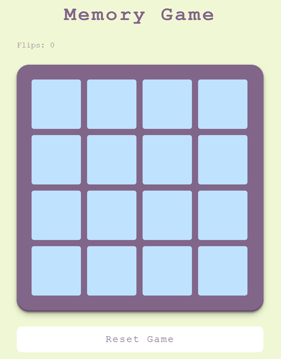
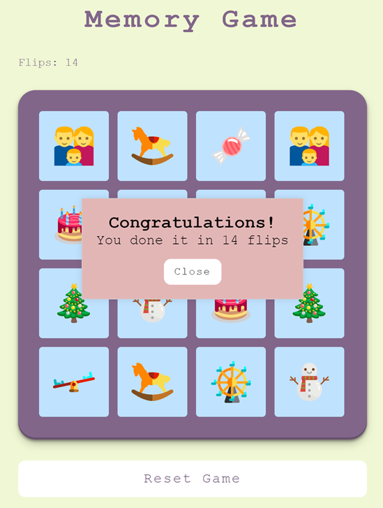

## Deploy

[Click here to Start the Game](https://imaginative-pothos-2e8e22.netlify.app/)

# Project "Memory Game" by Team 18

Welcome to the repository of the "Memory Game" project! This project is an exciting card-matching game where your goal
is to uncover all cards in the fewest number of moves possible.

## Technology Stack

- **Frontend:** React + TypeScript, React-Spring is used for animations
- **Backend:** Java, SpringBoot, Spring MVC, Spring Data JPA, Lombok, Slf4j, Logback
- **Database:** H2

## Project Overview

"Memory Game" is an engaging game where cards are randomly placed on the game board. Your task is to open cards in
pairs, memorize their positions, and uncover all cards with the minimum number of moves.

### Features

- **Displaying the Board:** Each round starts with a new random arrangement of cards.
- **Opening Cards:** Players can open cards, attempting to find pairs.
- **Closing Cards:** Unmatched cards automatically close, while pairs remain open.
- **Move Count:** The system tracks the player's number of moves.
- **Restarting the Game:** Players can start a new round at any time.
- **Congratulations Screen:** After successfully completing the game, a congratulations screen is displayed.
- **Leaderboard:** A rating of the best players and their best results is maintained.

## Contributors

- [Artem](https://t.me/Vault_dweller13) - Frontend
- [Evgeny](https://t.me/pelipets) - Backend
- [Yegor](https://t.me/chewho) - Frontend

## Memory Game Screenshots

1. **Game Board Overview:**

   - The first screenshot of the "Memory Game" displays a 4x4 grid.
   - A counter for card flips is located in the top left corner.
   - A button to start the game anew is positioned in the bottom center.

   

2. **Card Matching Process:**

   - In the second and third screenshots, it is evident that non-matching cards have closed.
   - Matching cards remain open, allowing players to remember their positions.

   
   

3. **Congratulations Screen:**

   - The final screenshot features the congratulatory screen at the end of the game.
   - The screen displays the total number of flips made during the game.

   

Thank you for your interest in our project! Questions and suggestions are welcome.

## Starting app on a local machine

1. Clone repository:
   ```bash
   git clone https://github.com/VaultDweller13/junior-hackathon.git
   ```
2. Navigate to the project directory:

   ```bash
   cd junior-hackathon
   ```

3. Install dependencies:

   ```bash
   npm install
   ```

4. Run one of the following commands:

   ### Dev server:

   ```bash
   npm run dev
   ```

   ### Build:

   ```bash
   npm run build
   ```

   ### Preview:

   ```bash
   npm run preview
   ```

   ### Lint:

   ```bash
   npm run lint
   ```

## How to start backend server

1. Clone the repository.
2. **Start the backend server:**

   - Make sure you have Java installed on your machine.

     - You need to install [Maven](https://maven.apache.org/download.cgi)
     - Unzip the archive into the installation directory, for example, "C:\Program Files\maven" on Windows or /opt/maven on Linux.
     - Set the M2_HOME environment variable to "C:\Program Files\maven".
     - Set the PATH environment variable to "%M2_HOME%\bin".
     - Verify the installation by typing the following command in the command prompt:
       ```bash
       mvn -version
       ```

   - Navigate to the `server` directory:

     ```bash
     cd server
     ```

     - Run Maven to clean and package the project:

       ```bash
       mvn clean package
       ```

     - Navigate to the `target` directory:

       ```bash
       cd target
       ```

     - Run the following command to start the backend server with the Java application:
       ```bash
       java -jar server-0.0.1-SNAPSHOT.jar
       ```

3. Enjoy the game and try to beat the records!

**Note:** If you are using a remote backend server, it is accessible at [http://45.8.248.224/](http://45.8.248.224/).
